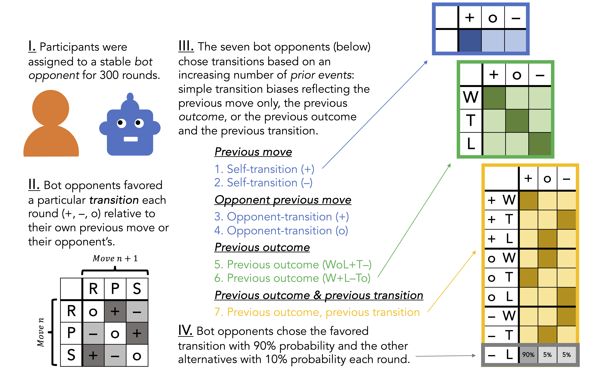

# Repeated rock, paper, scissors play reveals limits in adaptive sequential behavior

**Erik Brockbank & Edward Vul. *Cognitive Psychology* (2024). \[[LINK](https://www.erikbrockbank.com/static/docs/papers/cog%20psych%20-%20repeated%20rock%20paper%20scissors%20play.pdf) to paper\]**




```
@article{brockbank2024repeated,
  title={Repeated rock, paper, scissors play reveals limits in adaptive sequential behavior},
  author={Brockbank, Erik and Vul, Edward},
  journal={Cognitive Psychology},
  volume={151},
  pages={101654},
  year={2024},
  publisher={Elsevier}
}
```


## Abstract
How do people adapt to others in adversarial settings? Prior work has shown that people often
violate rational models of adversarial decision-making in repeated interactions. In particular,
in mixed strategy equilibrium (MSE) games, where optimal action selection entails choosing
moves randomly, people often do not play randomly, but instead try to outwit their opponents.
However, little is known about the adaptive reasoning that underlies these deviations from
random behavior. Here, we examine strategic decision-making across repeated rounds of rock,
paper, scissors, a well-known MSE game. In experiment 1, participants were paired with bot
opponents that exhibited distinct stable move patterns, allowing us to identify the bounds of
the complexity of opponent behavior that people can detect and adapt to. In experiment 2,
bot opponents instead exploited stable patterns in the human participants’ moves, providing
a symmetrical bound on the complexity of patterns people can revise in their own behavior.
Across both experiments, people exhibited a robust and flexible attention to transition patterns
from one move to the next, exploiting these patterns in opponents and modifying them
strategically in their own moves. However, their adaptive reasoning showed strong limitations
with respect to more sophisticated patterns. Together, results provide a precise and consistent
account of the surprisingly limited scope of people’s adaptive decision-making in this setting.


## License

- All data in `/data` is licensed under **CC0 1.0 Universal** (see `LICENSE-CC0`).
- All figures and experiment stimuli are licensed under **Creative Commons Attribution 4.0 International (CC BY 4.0)** (see `LICENSE-CC-BY-4.0`).
- Experiment and analysis code is licensed under the MIT License (see `LICENSE`).